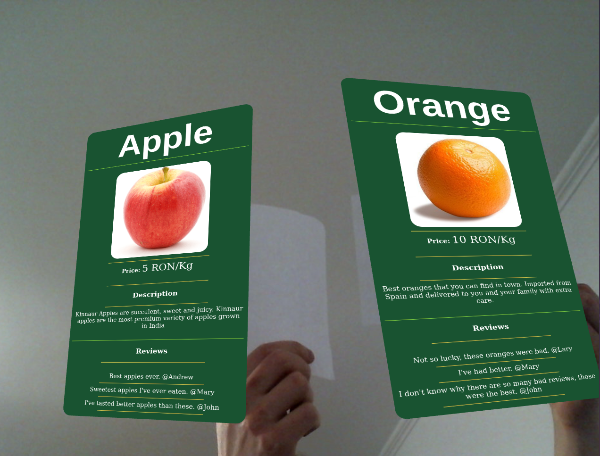

# AR-product-info

Using your webcam, this software identifies some markers and then it draws(using the [aframe](https://aframe.io/) library) for each marker, details of a product that has that marker assigned to it. The drawing of the product detalis is done using the [aframe-htmlembed-component](https://github.com/supereggbert/aframe-htmlembed-component) component. The library draws the product using a html template.

An enhanced version of this software can be used inside a phisical store, where the customers have glasses with a camera wich draws the details for products that are in the custumer's field of vision(or to which product does the client point to, using his hand).

## Demo



## How to use

Open the `index.html` in broswer without a http server.

Or start a http server:

```bash
python3 -m http.server
```

Go to: `localhost:8000`

## Add new product:

Adding a new product to this software is very simple, you just need to create a new entry in [this array](js/products.js), this array can be replaced with an api from a server that is conencted to a db. The marker used for that new product should be added in the `preset` member.

## Sources used for implementing this project

 - Source of inspiration: https://medium.com/arjs/augmented-reality-in-10-lines-of-html-4e193ea9fdbf
 - Source of inspiration: https://mayognaise.github.io/aframe-html-shader/basic/index.html - Couldn't make it work, re render at run time. Even after seting the frame to a number different than 0. When the detalis changed for a product, the html wasn't rerendered.
 - Source of inspiration: https://github.com/supereggbert/aframe-htmlembed-component

## Interesting improvements:

 - Track the hand and show trhe product detalis only for the product we are pointing to.
 - Use barcodes instead of markers.
